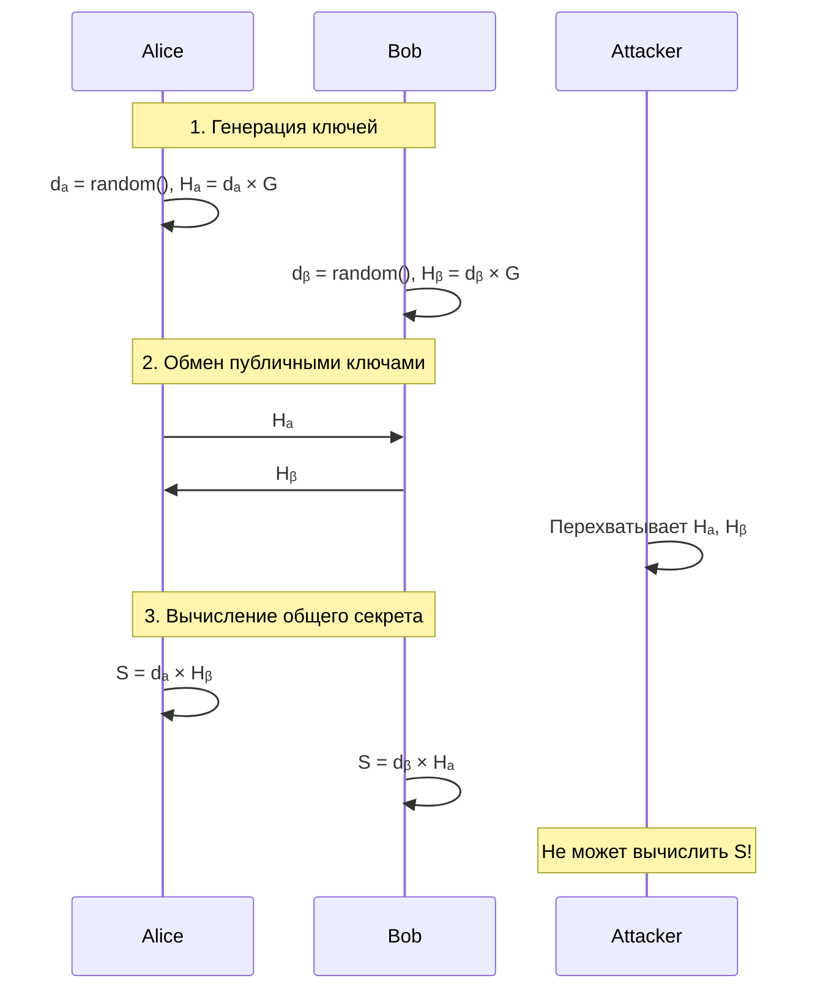

# Криптография на эллиптических кривых (Elliptic Curve Cryptography)

## Часть 1. Эллиптические кривые над полем вещественных чисел

### Эллиптические кривые

В общем случае эллиптические кривые представляют собой множество точек, удовлетворяющих уравнению:

$$y^{2} + a_{1}xy + a_{2}y = x^{3} + a_{3}x^{2} + a_{4}x + a_{5} \quad\quad (1)$$

Однако нас будет интересовать **частный вид** этого уравнения:

```
y² = x³ + ax + b
где 4a³ + 27b² ≠ 0
```
>  Условие `4a³ + 27b² ≠ 0` необходимо, чтобы избежать вырожденных (особых) кривых с сингулярными точками.
> 
Для наглядности, давайте рассмотрим примеры эллиптических кривых.

### Примеры эллиптических кривых


#### Кривая secp256k1 (Bitcoin и Ethereum)

Пример кривой, которая используется в криптовалютах Bitcoin и Ethereum:

$$y^{2} = x^{3} + 7 \quad\quad \text{(secp256k1)}$$


### Построение группы на эллиптических кривых

Для создания эффективной модели шифрования необходимо построить **группу над эллиптическими кривыми**.

Основные элементы группы:
- **Элементы группы**: точки на эллиптической кривой
- **Нейтральный элемент**: бесконечно удаленная точка `O`
- **Обратный элемент**: для точки P обратной является точка, симметричная относительно оси Ox
- **Операция сложения**: сумма трех коллинеарных точек P, Q и R равна нулю: `P + Q + R = O`

Также не трудно доказать, что в такой группе операция сложения будет **ассоциативна и коммутативна**, следовательно, наша группа – **абелева группа**.

### Арифметика на кривых

Исходя из свойств абелевой группы, можем получить:

$$P + Q + R = O \Rightarrow P + Q = -R$$  
**Пример**  


Предположим, что точка Q стремиться к точке P. Тогда в пределе будем получать, что
 ```P + P =-R ```и график будет принимать такой вид:


> Гифка отсюда -> [elliptic-curve-cryptography-a-gentle-introduction ](https://andrea.corbellini.name/2015/05/17/elliptic-curve-cryptography-a-gentle-introduction)  
> Здесь можно найти более строгое обоснование операций.


Определим кратное сложение точки самой с собой, оно понадобиться дальше:

$$kP = P + P + \ldots + P \quad \text{(k раз)}$$

где `k` — количество сложений точки P самой с собой для получения точки Q.

### Переход к конечным полям
Мы определили операции, но тут выскакивает проблема: из-за непрерывности области:   
```
X_max = ∞  
Y_max = ∞  
```
это дает понять, что нужна бесконечная область памяти для вычислений с плавающей точкой. Поэтому для решения этой проблемы мы переходим к **конечным полям** и рассматриваем только целые точки.

Пусть `p` — простое число, а `Fₚ` — порождённое им конечное поле. Уравнение кривой принимает вид:

```
y² ≡ x³ + ax + b (mod p)
где 4a³ + 27b² ≢0 (mod p)
```
А график кривых будет иметь следующий вид:


Не смотря на то, что мы перешли из непрерывного пространства в конечное поле, операции над кривыми остаются такими же.
> Как происходят эти опрации(и много других анимаций) можно посмотреть тут [The Animated Elliptic Curve](https://curves.xargs.org)


Такой переход дает нам ряд **преимуществ**: 
-  Конечное множество точек  
-  Точная арифметика (без округлений)  
-  Высокая скорость вычислений  
-  Криптографическая стойкость


---

## Криптография на эллиптических кривых

### Основные принципы

**ECC является асимметричным шифрованием**, т.е. шифруется приватным ключом, а расшифровываем публичным. В роли публичного ключа выступает точка P, точка на кривой. Что касается приватного ключа, то сначала стоит определить еще одну публичную переменную – генераторную точку G (базовая точка с известными координатами). Она выбирается умными людьми так, чтобы в конкретном поле для конкретной кривой из точки G можно было попасть в наибольшее количество точек кривой. Более строго можно сказать, что G выбирается так, чтобы порядок подгруппы, получающейся из точки G, был *ближе всего* к порядку группы.

### Связь между ключами

Связь между приватным и публичным ключами:

$$P = kG$$

где:
- `k` — **приватный ключ** (количество "прыжков")
- `P` — **публичный ключ** (конечная точка после k прыжков из точки G)

### Задача дискретного логарифмирования (ECDLP)

$$P = kG \quad \Rightarrow \quad k = \frac{P}{G}$$

**ECDLP является вычислительно неразрешимой задачей**:
- Вычислить P, зная k и G — **лёгкая задача**
- Вычислить k, зная P и G — **очень сложная задача**

ECDLP является эффективно неразрешимой задачей, т.е. нет sub-exponent алгоритма дискретного логарифмирования, что делает эту особенность удобной для использования в криптографических целях и гарантирует надежность.

### Примеры задач ECDLP

#### **Пример 1**:
**Дано:**
   - Кривая: `y² = x³ - 7x + 10` в поле **F₁₁**
   - G = (9, 4)
   - nG = (8, 2)

**Найти:** n = ?

Так как мы знаем, что `p = 11`, то нам достаточно найти порядок подгруппы из точки G, а именно методом простого перебора перебрать все значения n из `[1, 11]`.


#### Пример 2:
**Дано:**
- Поле: **F₉₆₇₉**  
- G = (6517, 122)
- nG = (6686, 3871)

**Найти:** n = ?

С увеличением числа `p` задача перестает казаться простой.

### Реальные криптографические параметры

#### Для Bitcoin/Ethereum (secp256k1):

**Размер поля:**
```
p = 2²⁵⁶ - 2³² - 2⁹ - 2⁸ - 2⁷ - 2⁶ - 2⁴ - 1
```

**Координаты генераторной точки G:**
```
Gx = 0x79BE667EF9DCBBAC55A06295CE870B07029BFCDB2DCE28D959F2815B16F81798
Gy = 0x483ADA7726A3C4655DA4FBFC0E1108A8FD17B448A68554199C47D08FFB10D4B8
```

**Порядок группы (количество точек):**
```
n = 0xFFFFFFFFFFFFFFFFFFFFFFFFFFFFFFFEBAAEDCE6AF48A03BBFD25E8CD0364141
```

> **Стойкость:** С такими параметрами взлом приватного ключа потребует ~2¹²⁸ операций, что практически невозможно.


## Алгоритм Диффи-Хеллмана на эллиптических кривых

**ECDH (Elliptic Curve Diffie-Hellman)** решает задачу безопасного обмена ключами:

> Как Алисе и Бобу договориться об общем секретном ключе через незащищённый канал?

### Алгоритм работы

#### Подготовка:
1. Выбирается эллиптическая кривая и конечное поле
2. Определяется генераторная точка G

#### Шаги протокола:



**Алиса вычисляет:**
```
S = dₐ × Hᵦ = dₐ × (dᵦ × G) = (dₐ × dᵦ) × G
```

**Боб вычисляет:**  
```
S = dᵦ × Hₐ = dᵦ × (dₐ × G) = (dᵦ × dₐ) × G
```

**Результат:** `S_Alice = S_Bob` 

#### Безопасность:

**Атакующий знает:** G, Hₐ, Hᵦ  
**Атакующий НЕ знает:** dₐ, dᵦ  
**Чтобы найти S, нужно решить ECDLP** → практически невозможно!

###  Преимущества ECC:

1. **Высокая безопасность** при относительно малых размерах ключей
2. **Быстрые вычисления** по сравнению с RSA
3. **Меньшее потребление памяти** и энергии
4. **Масштабируемость** для устройств с ограниченными ресурсами

###  Сравнение размеров ключей:


### Применения ECC:

- **Блокчейн**: Bitcoin, Ethereum, другие криптовалюты
- **Мобильные устройства**: защищённые соединения  
- **TLS/SSL**: безопасные веб-соединения
- **Смарт-карты**: банковские карты, документы
- **VPN**: защищённые туннели
- **Email**: цифровые подписи
